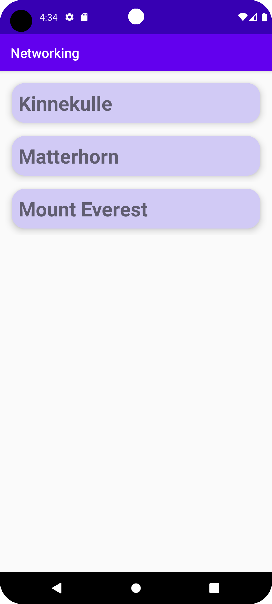

# Rapport

Added a Recycler view container into the layout in activity_main.xml:

```
    <androidx.recyclerview.widget.RecyclerView
        android:id="@+id/recyclerView"
        android:layout_width="match_parent"
        android:layout_height="match_parent"
        android:layout_margin="8dp"
        android:layout_marginStart="8dp"
        android:layout_marginLeft="8dp"
        app:layout_constraintBottom_toBottomOf="parent"
        app:layout_constraintStart_toStartOf="parent"
        app:layout_constraintTop_toTopOf="parent" />
```
Added a new layout resource file "recycler_view_row.xml" and created a card view and a text view with some styling to make the presentation of the items more clear:

```
<androidx.constraintlayout.widget.ConstraintLayout xmlns:android="http://schemas.android.com/apk/res/android"
    xmlns:app="http://schemas.android.com/apk/res-auto"
    android:layout_width="match_parent"
    android:layout_height="wrap_content">

    <androidx.cardview.widget.CardView
        android:layout_width="match_parent"
        android:layout_height="wrap_content"
        app:layout_constraintBottom_toBottomOf="parent"
        app:layout_constraintEnd_toEndOf="parent"
        app:layout_constraintStart_toStartOf="parent"
        app:layout_constraintTop_toTopOf="parent"
        android:layout_margin="10dp"
        app:cardBackgroundColor="@color/purple"
        app:cardCornerRadius="20dp"
        app:cardElevation="8dp">


        <TextView
            android:id="@+id/textView"
            android:layout_width="wrap_content"
            android:layout_height="wrap_content"
            android:text="TextView"
            android:textSize="30dp"
            android:textStyle="bold"
            android:layout_margin="10dp"/>
    </androidx.cardview.widget.CardView>
</androidx.constraintlayout.widget.ConstraintLayout>
```

Added an array list in MainActivity.java and created Mountain.java where a variable "name" created with a constructer and a getter:

```
private ArrayList<Mountain> mountainArrayList = new ArrayList<>();

```

```
public class Mountain {
    private String name;

    public Mountain(String name) {
        this.name = name;
    }

    public String getName() {
        return name;
    }
}
```

Created RecyclerViewAdapter.java to create a adapter class and viewHolder. Here specifies how the recycler view going to function and links the items to the textView in recycler_view_row.xml OnClickListener was added to present what the user clicked on: 

```
public class RecyclerViewAdapter extends RecyclerView.Adapter<RecyclerViewAdapter.ViewHolder> {

    private static List<Mountain> items;
    private static OnClickListener onClickListener;
    Context context;

    public RecyclerViewAdapter(Context context, List<Mountain> items, OnClickListener onClickListener) {
        this.context = context;
        this.items = items;
        this.onClickListener = onClickListener;
    }

    @Override
    @NonNull
    public ViewHolder onCreateViewHolder(@NonNull ViewGroup parent, int viewType) {
        LayoutInflater inflater = LayoutInflater.from(context);
        View view = inflater.inflate(R.layout.recycler_view_row,parent, false);
        return new RecyclerViewAdapter.ViewHolder(view);
    }

    @Override
    public void onBindViewHolder(ViewHolder holder, int position) {
        holder.textView.setText(items.get(position).getName());
    }

    @Override
    public int getItemCount() {
        return items.size();
    }

    public static class ViewHolder extends RecyclerView.ViewHolder implements View.OnClickListener {
        TextView textView;

        public ViewHolder(@NonNull View itemView) {
            super(itemView);
            itemView.setOnClickListener(this);
            textView = itemView.findViewById(R.id.textView);
        }

        @Override
        public void onClick(View view) {
            onClickListener.onClick(items.get(getAdapterPosition()));
        }
    }

    public interface OnClickListener {
        void onClick(Mountain item);
    }
}

```

In the MainActivity.java file is where the RecyclerViewAdapter was implemented in onCreate:

```
    @Override
    protected void onCreate(Bundle savedInstanceState) {
        super.onCreate(savedInstanceState);
        setContentView(R.layout.activity_main);

        new JsonFile(this, this).execute(JSON_FILE);

        RecyclerView recyclerView = findViewById(R.id.recyclerView);
        RecyclerViewAdapter adapter = new RecyclerViewAdapter(this, mountainArrayList, new RecyclerViewAdapter.OnClickListener() {
            @Override
            public void onClick(Mountain item) {
                Toast.makeText(MainActivity.this, item.getName(), Toast.LENGTH_SHORT).show();
            }
        });


        recyclerView.setLayoutManager(new LinearLayoutManager(this));
        recyclerView.setAdapter(adapter);
    }
```

In onPosteExecute, added items into the array list:

```
    @Override
    public void onPostExecute(String json) {
        Log.d("MainActivity", json);

        Type type = new TypeToken<List<Mountain>>() {}.getType();
        mountainArrayList = gson.fromJson(json, type);

    }
```





